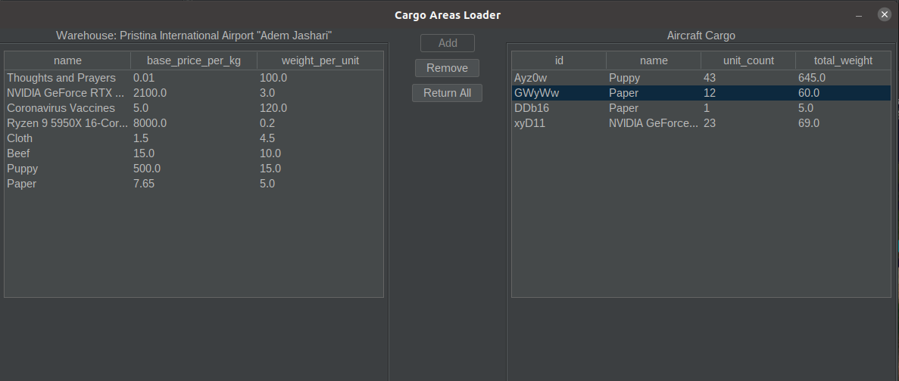

# FLAPS Report

**First author**:  Radu Rebeja (s4051297)

**Second author**: Eugen Falca (s)

## Introduction

Our Aircraft Editor offers Cargo manipulation and Aircraft refuel features. 
The blueprint graphical interface offers the ability to select compartments based on their location and track the position of the center of gravity.

Upon selection of a compartment area, its data will be displayed and specific setting options will appear to the user.

Cargo Areas offer the setting of exchanging cargo with the airports warehouse and selecting specific amounts of cargo
to store in the designated cargo area. The user may also remove an amount, all remove all cargo from a cargo area.
Undo/Redo covers any changes made in the cargo trade environment. 

Fuel Tanks can be refueled with the help of a slider that is capped at the fuel tanks capacity, thus not allowing 
overfilling.\
All changes in weight across all compartment types affect in real-time the position of the center of gravity 

The program also shows the Aircraft Data and Commercial Data in real time, values are changed by user changes to the
aircraft load.

## Program design
Main Package - .view: \
Package .maineditor:\
This package contains all the main panels that are part of the Aircraft Editor frame.
The layout follows common styles. The main goal was to always maintain app scalability while constructing internal
components. Therefore, classes like InfoPanel do not explicitly implement all data shared with the user. It collects
data fields computed in separate objects and construct the panel's internal components out of all the extracted field
data that is filtered and laid out with a stable Layout manager.
BlueprintDisplay uses the same technique as the WorldPanel class.
Package .cargoeditor:\
This package contains all class components concerned with the cargo trade frame view environment. Here, we 
chose to make CargoTablesPanel a separate class that gives us polished JTables with specific TableModels, in order to
separate JTable implementation and code dublication.

Main Package - .model  \
(Class) BlueprintSelectionModel implements a different method from the one employed in the .world package ( for selection
of airports). Instead of iterating over a list, which might increase greatly in size, we use nested NavigableMaps 
to identify compartment locations relative to cursor click locations faster. 
(Class) EditorCore is the heart of the application, as it executes the primary (default) view updates.

Package .undomodel :\
Contains the undo adapter coordinated edit storing.

MainPackage - .controller \
(Class) AircraftDataTracker & CommercialDataTracker - we chose to implement classes that gather all relevant aircraft data which is then
supplied to the InfoPanel. Therefore, we can increment the data complexity by connecting new classes to this main class.

Package .execcomm :\
Contains all the objects extending from the abstract class Command, it features all available user configuration settings.
We chose to apply the Command Pattern here, since it offers great scalability and good class organization. We then combined
the pattern with the MementoPattern to save the state of changed objects in the program.
package .commrelay:\
Contains an upper abstract class, and all classes extending from it , implement its methods following the Command Pattern 
help with scalability.

Package .configcore:\
Contains the Configurator class, it uses the MediatorPattern by creating and executing all command objects;

## Evaluation of the program

All assignment requirements were implemented correctly and work well. All bugs were eliminated, edge cases were covered by
setting constraints in certain cases (eg. concurrent Cargo Trade windows, Editor windows ). One side feature which didn't work was
to relay all the "travel statistic" data through the log panel upon arrival, we suspect it might be a thread issue, since we used Thread.sleep
multiple times and it might have created conflicts. We chose to use JOptionPanes instead. 
Everything was implemented as planned. Radu Rebeja will continue to improve the application for the competition.
Future feature ideas are still in the works.

## Process evaluation

Everything was quite easy except for the coordinates and remapping of compartment areas. It required some debugging to identify
mistakes. Also, we tried to improve accurracy in the selection of compartments and that required some reviewing of our lowerEntry/higherEntry
approach.
We made some interesting mistakes, but the project became larger than our ability to track the history of mishaps.

## Conclusions

Throughout the entire process the main focus was on scalability and code abstraction, the less we relied on custom 
methods the better. We always seeked to automize computation and generation of components as much as we could
