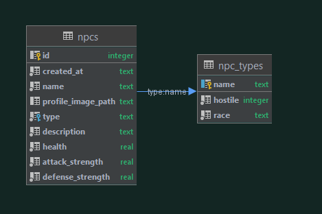
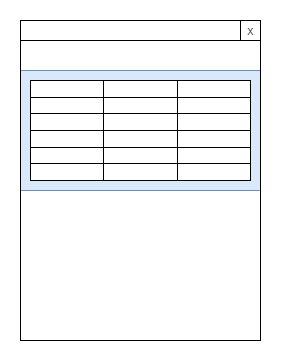
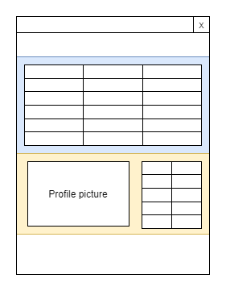
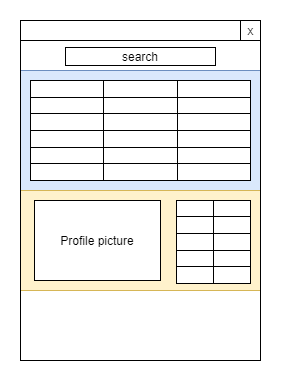
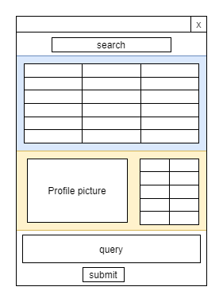
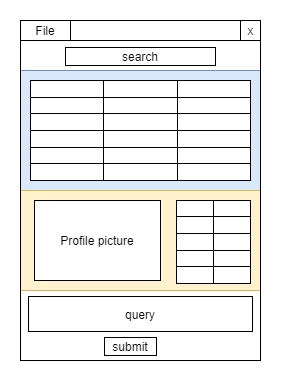

# GUI

For the third installment in this magnificent streak of assignments, you will be creating an application that can interact with a database. Not to worry though, the most important database parts have been provided to you. The goal of this is to help you get familiar with creating a GUI (Graphical User Interface) in Java. To accomplish this, you will be using the Model-View-Controller (MVC) pattern.

You will be implemented the GUI using Java Swing. We do not use this because it creates the prettiest applications (although it definitely can), but rather because it nicely teaches you the basics of creating GUIs. There are lots of big applications written using Swing (IntelliJ for example) and it is still widely used.

From this assignment onward, we will also be less specific about what you have to implement. We will still provide a list of requirements, but it is up to you to determine how to implement them. This is also done to simulate a bit more accurately what would happen in the real world. Most often, you are not given an extensive list with concrete requirements, but rather some vague descriptions of what the application should do. Lucky for you, we won't be that vague though...

That said, in some cases it is up to you to decide what the program should display (e.g. if the user did not select anything). Simply think about what you would expect a real world application to do in these kinds of scenarios.

In addition to the requirements we provide, there are also some constraints (as you will see later on), where you have to implement certain things yourself instead of using existing tools/libraries. The reason for this is to give you an idea of how these things actually work instead of blindly using them.

Additionally, you might find that not everything asked from you here has been discussed during the lectures, tutorials or in the reader. There is an enormous collection of different classes that Swing provides and it is impossible to cover them all. As such, you will have to use Google for most of it. Lucky for you, the documentation provided by Oracle (which we also link in certain cases) is quite good. This is also a nice way to train your Google skills; arguably one of the most important skills you can have as a software engineer. That said, there is still a bunch of basic info available to you via the tutorials and reader, so be sure to look at this before you start (◔‿◔)

> Hint: One very useful (visual) resource for Swing components you can use can be found [here](https://web.mit.edu/6.005/www/sp14/psets/ps4/java-6-tutorial/components.html).

## Working Together on (Larger) Projects

As the amount of required code for the assignments increases, so does the difficulty of properly managing such a project. We will provide you with some tips about how to deal with this. Note this part is not mandatory, it will simply make things a bit easier to manage.

### Organising Tasks

Before you start, it is a good idea to have a brainstorm session. Write down all the things you want and need to do for this project. Now you should have a good idea of what you want to implement. Try to split these things into different tasks and sort them by priority. You now have a list of things you need to do and the order you need to do them in. Awesome! This is called a backlog. Since you are working together, it is a good idea to assign a person to each task (unless you do everything together). The simplest form this takes is a table that looks something like this:

| What                                      | Who                           | When (deadline) |
| ------------------------------------------|-------------------------------|--|
| The view should update when the model updates    | Niels                         | 09/05 at 12:00
| The user should be able to export the database to csv    | Erblin                        | 11/05 at 12:00 |
| Take over the RUG (つ◕౪◕)つ━☆ﾟ.*･｡ﾟ       | ~~Niels~~ ~~Erblin~~ Niels    | 2023 |

It is not necessary to create the entire backlog in one go. You can keep adding new tasks to it throughout the development process. Whenever a task is done, you can marked it as such or remove it. If you decide to remove it, it is a good idea to save it somewhere so that you have a good idea of what has been done already.

As you can see backlogs are a nice way to keep track of what still needs to be done. You can add a lot more detail to this backlog such as estimations of how long tasks will take, but also splitting up tasks even more. Try not to make your tasks too big, because that will make it difficult to properly distribute tasks and see progress.

>Tip: There are a few different ways you can make such a backlog. An easy one would be Google Sheets, but a more dedicated tool that you can also go for is [Trello](https://trello.com/), which is what we would recommend. Especially in the current online situations, these can be incredibly helpful as it makes communication with your partner a lot smoother. After all, it should now be very clear who needs to do what (and before when).

# Databases

As mentioned before, you will be creating a GUI application that allows the user to view data within a database and interact with it. Throughout this assignment, we will be using [SQLite](https://www.sqlite.org/index.html). We expect you to have a very basic understanding of databases. Not to worry though; we have implemented all of the database functionality for you. As such, before you start working on the assignments, be sure to carefully read through the code (and Javadoc especially!) we provide to you. You do not have to understand every single thing, but eventually you will need to interact with it, so it's good to roughly understand how it works. Reading (complex) code is actually also something that you will run into a lot in software engineering, so this is already a good place to get some practice. 

The database we have provided to you contains data about NPCs. The schema of this database looks as follows:



Some example data can be found below. Note that not all fields are included here to save some space.

**NPC**
|id|created_at|name|type|health|attack_strength|defense_strength|
|----|----|----|----|----|----|----|----|
| 1 | 1931-03-17T14:02:00 | Fëanor | Warrior | 120 | 67 | 150 | 
| 2 | 1942-06-01T05:47:37 | Finwë | Ranger | 60 | 30 | 89 | 
| 3 | 1978-07-21T19:12:08 | Celebrimbor | Archer | 75 | 55 | 72 | 
| 4 | 1934-12-29T22:55:00 | Durin | Miner | 70 | 40 | 180 | 
| 5 | 1982-02-27T09:45:54 | Elendil | Trader | 175 | 132 | 168 | 
| 6 | 1982-05-06T13:25:12 | Aragorn II | Warrior | 175 | 132 | 168 | 
| 7 | 2001-01-24T08:03:44 | Meriadoc Brandybuck | Brewer | 50 | 15 | 35 |


**NPC Type**
|name|hostile|race|
|----|----|----|
|Trader | FALSE | Human | 
|Warrior | TRUE | Human | 
|Archer | TRUE | Elf | 
|Ranger | FALSE | Elf | 
|Miner | FALSE | Dwarf | 
|Brewer | FALSE | Hobbit |

As you can see, we have a table of NPCs and there is also a separate table with NPC types. These two are connected, since each NPC has a certain type. The specifics of the database schema can be found in a file called `schema.sql` in the `resources` directory. 

### Table

In general, Swing components that display some underlying data are implemented by creating an empty visual component that's bound to a data model that provides the information needed to render each segment of the visual component. In the case of tables, the `JTable` is the visual component, and is linked to a `TableModel` that supplies information about how big the table is, what columns there are, and what to render in each cell.

You should create your own table model which extends from the `AbstractTableModel`, or implements `TableModel` if you really want to customize everything. The model should keep an internal data structure which holds all the objects that should be shown in the table, and should implement some methods to, for example, determine what object is rendered in a particular table cell. Note that, despite its name, this class should ideally be placed in the `view` (although technically arguments can be made for both sides). While this table model only contains some data and logic, it only exists in the context of (and because of) the view. 

> Hint: For more information about how to do this, you can look at the [tutorial](https://docs.oracle.com/javase/tutorial/uiswing/components/table.html) by Oracle under the section `Creating a Table Model`.

## Creating a Basic View

Throughout this assignment description, we will be providing some diagrams about what your UI could look like. You do not need to follow it exactly; it is just a visual illustration of what could be done.



As shown in the tutorial, make a basic JFrame. For applications like this one where one component (the table) should be the center of focus, we should ideally use a `BorderLayout`, and add the table using the `BorderLayout.CENTER` constant. This ensures that it appears at the center of the view and greedily expands to fill space as the view's size changes. For more information on the `BorderLayout`, you can look [here](https://docs.oracle.com/javase/tutorial/uiswing/layout/border.html). The table should only contain a subset of the columns (e.g. only show the `id`, `created at` and `name`).


## Creating the Details View



Whenever the user clicks on a certain row, the UI should update so that the details of this particular entry are displayed. Remember that the table only shows a subset of the columns. This detail panels makes sure that our users can view all the info of the NPC. Whenever an NPC is selected, it should also display information about the corresponding NPC type. For determining when the user selects an item in the table, you are allowed to use a `ListSelectionListener`.

For displaying the details of an entity, you could use a dedicated component which extends from a `JPanel`. How you organize and display the data within this panel is up to you, as long as it is all present using different components. This means that you cannot simply add a `JTextArea` and print all the values of the entity in it as plain text. `JLabel` is often used for displaying single-line texts or images.

Once you've made your details panel, you can add it to the main view, possibly with the `BorderLayout.NORTH` constant to put it on the top side of the view, for example.

### Profile Images

The database contains, for each NPC, the name of the image that is associated with said NPC. This profile image should also be displayed in this details view whenever an entry is selected. You can retrieve the image and put it into a `JLabel` as follows:
```java
/* Read image */
BufferedImage img = ImageIO.read(Path.of("images", entity.getProfileImagePath()).toFile());
/* Creates a new JLabel with an image. The image is rescaled to a size of 200 x 100 */
new JLabel(new ImageIcon(image.getScaledInstance(200, 100, BufferedImage.SCALE_SMOOTH)))
```
> Tip: Make sure your program does not crash when the image does not exist or when the profile image path is not defined for an entry.

## Search Bar



Now that there is a basic view, lets start working on some actual user input. At some point, we might add more stuff to our dataset, so we want to allow the user to search (for a name) in the dataset. 

Implement a simple search bar by creating a class that extends from [JTextField](https://docs.oracle.com/javase/7/docs/api/javax/swing/JTextField.html). Whenever the user types something, your custom table model should update. For this you should use the observer pattern. However, you should implement this yourself. This means that you are not allowed to use existing classes/interfaces for this (e.g. `PropertyChangeListener` or `Observer`/`Observable`). 

You can add the following snippet to your class (provided that it extends `JTextField`) to call a method each time the user types a character. This will be useful in combination with your observer pattern implementation.
```java
this.addKeyListener(new KeyAdapter() {
    @Override
    public void keyReleased(KeyEvent e) {
        super.keyReleased(e);
        // I am called whenever the user types a new character
        doSomething();
    }
});
```


## Custom Query Field



Now that there is a search field, the user should also be able to do some more complex queries, such as deletions, updates and insertions. To facilitate this, you can add a [JTextArea](https://docs.oracle.com/javase/tutorial/uiswing/components/textarea.html) where the user can type their query.

The user should be able to submit the query field by clicking a button with the text `execute query`. This should update the model and view appropriately. Note that the only queries we expect the user to execute are insertions, updates and deletions. 

The following are some example queries that the program should accept, provided you have not modified the original schema:

```sqlite
/* Make the trader NPC type hostile */
UPDATE npc_types
SET hostile = TRUE
WHERE name = 'Trader';

/* Adds a new NPC. */
INSERT INTO npcs (name, type, description) VALUES
('Andrew', 'Miner', 'A teaching assistant.');

/* Removes the NPC added in the previous example. */
DELETE FROM npcs WHERE name = 'Andrew';
```

## Custom Export



Lastly, lets add some IO related things. The program should have some functionality that allows the user to export whatever is in our database to a custom file format. We recommend you to do this to CSV (as it is the easiest), but you can choose any of the following file formats: 

- CSV
- YAML
- XML
- JSON

Note that you are not allowed to use a library to convert the table data into these file formats! You have to implement this yourself (e.g. using a [PrintWriter](https://docs.oracle.com/en/java/javase/11/docs/api/java.base/java/io/PrintWriter.html)). Since some of these are more difficult to implement than others (CSV being the easiest), you can get some bonus points for choosing one of the more difficult ones.

Add a [menu](https://docs.oracle.com/javase/tutorial/uiswing/components/menu.html) bar to the frame and make sure it has a menu called `File`. Clicking on this should produce a dropdown that contains the option `export to <fileformat>` where `<fileformat>` is the file format you chose.  

This option should open a popup that allows the user to select a file. To do this, you can use a [JFileChooser](https://docs.oracle.com/javase/tutorial/uiswing/components/filechooser.html) (make sure only files of the given file format are shown). Once the user has selected a file, your program should write the database to a file with said name.

## Error Handling

Now that we are creating a GUI application, our error handling should obviously be a bit different. You should not be printing to System.out anymore, as the user will not be looking at this when they are busy with the application. As such, make sure that error messages are displayed in a popup. To do this, you can look into [JOptionPane](https://docs.oracle.com/javase/tutorial/uiswing/components/dialog.html).

Once again, be very thorough when testing your application. There should be no way for the user to produce a stacktrace in your program.

## 4 Requirements
The requirements for the program are as follows:

- You should have a correctly working application that allows the user to view and interact with the provided database.
- It should have a GUI.
- The user should be able to view the NPCs that are in the database.
- Clicking on one of the table rows should display additional information of that entry.
- The user should be able to search for entries in the database using a search field.
    - The search field should send out updates on each keystroke.
- The user should be able to execute custom queries that they can provide using a text area.
    - Whatever text is in this text area should be submitted by pressing a button.
    - It only needs to support the following operations: insertions, updates and deletions.
    - The view should of course be updated accordingly.
- The user should be able to export the contents of the database to one of the aforementioned file formats.
    - This functionality should reside in a menu bar.
    - You must implement the export functionality yourself; you cannot use any libraries/tools for it.
- It should have a correct Model-View-Controller structure.
- You are not allowed to use `PropertyChangeListeners`, `Observer`/`Observable` or any other implementation of the observer pattern. You have to implement this yourself. There are two exceptions to this rule: the `KeyListener` and the `ListSelectionListener`.

There is one more restriction here: you are not allowed to use `Threads`. These are covered in Advanced OOP and can be quite hard to debug.

## 5 Handing In

You know the drill by now. Create a pull request from `gui` into `main`. Make sure the pull request does not result in any merge conflicts.

***

The point distribution for your grade will look as follows:

| Category      | Max points    |
| ------------- |:-------------:| 
| Functionality | 5             |
| Design        | 3             |
| Clean code/code quality | 1   | 
| Documentation | 1             |
| Bonus         | 1             |

Note that properly following the MVC pattern is very important for the design.